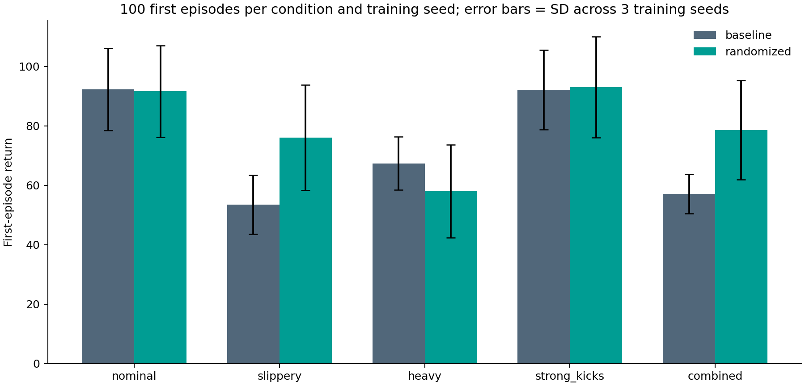
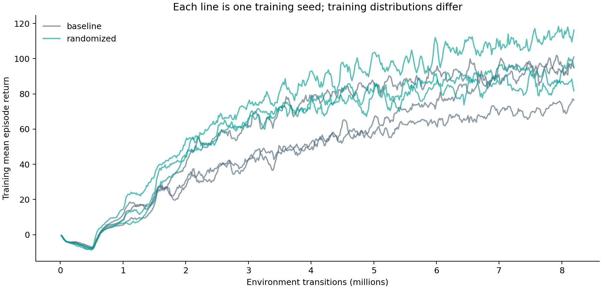

# 처음 보는 환경에서도 잘 걷는 Ant — 실험 보고서

## 목표와 결론

목표는 학습하지 않은 환경에서도 Ant가 전진하며 넘어지지 않도록 하는 것이다. 마찰·질량·수평 속도 교란을 무작위화한 PPO를 같은 예산의 기준 PPO와 비교했다.

학습 범위 밖의 자체 평가 4조건 평균 보상은 기준 **67.53**, 무작위화 **76.43**로, 무작위화가 **8.91점 높았다**. 4조건 중 3조건에서 평균 보상이 높았다(slippery, strong_kicks, combined). 이 결과는 아래 조건과 3개 학습 시드에 한정한다. 조교의 비공개 평가 결과는 아직 없다.

## 실험 설계

관측 60차원, 행동 8차원, 보상과 Ant 기본 PPO 설정을 유지했다. 방법별 학습 시드는 11·22·33, 병렬 환경 512개, rollout 32스텝, 업데이트 500회로 고정했다. 정책당 8,192,000 transitions이며 총 6개 정책을 학습했다. 평가는 모든 학습이 끝난 뒤 수행하고 최종 체크포인트만 사용했다. 중간 체크포인트나 가장 좋은 시드를 평가 결과에 맞춰 고르지 않았다.

기준 환경은 마찰 1, 질량 배율 1, 외부 교란 없음이다. 제안 환경은 마찰 [0.5,1.25], 각 몸체 질량 [0.8,1.2]배, 4~7초마다 x/y 속도 각 축 ±0.3 m/s의 오프셋을 사용했다. 물성은 startup 때 collision shape/body별로 독립 샘플링하고 해당 병렬 환경 안에서 고정한다. 에피소드마다 물성을 재추출하지 않는다. 바닥 마찰 1과 multiply 조합을 양쪽에서 통일했으므로 원본 USD 물성을 완전히 그대로 둔 기준은 아니다.

평가 조건은 학습 전에 protocol.json에 고정했다. slippery는 마찰 0.2, heavy는 질량 1.5배, strong_kicks는 3초마다 ±0.8 m/s, combined는 마찰 0.3·질량 1.35배·3초마다 ±0.5 m/s다. 각 물성 변화 또는 교란 크기는 학습 범위 밖이다. 모든 조건은 평평한 바닥이며 미관측 지형 실험은 아니다.

## 정량 결과

방법·학습 시드·조건별 100개 환경의 **첫 에피소드**를 평가했다. 종료 스텝 보상을 포함하고, 먼저 끝난 환경의 자동 리셋 이후 보상은 제외했다. 최대 길이는 16초(960 제어 스텝)다. 평가 시드는 20261007이다.

| 조건 | 기준 보상 | 무작위화 보상 | 기준 / 무작위화 생존율 | 기준 / 무작위화 전진량(m) |
|---|---:|---:|---:|---:|
| nominal | 92.26 ± 13.79 | 91.62 ± 15.37 | 88.0% / 75.7% | 94.52 / 97.39 |
| slippery | 53.54 ± 9.95 | 76.09 ± 17.76 | 93.7% / 100.0% | 56.46 / 82.77 |
| heavy | 67.39 ± 8.98 | 58.02 ± 15.66 | 92.0% / 89.0% | 69.28 / 59.63 |
| strong_kicks | 92.12 ± 13.34 | 93.02 ± 16.98 | 88.7% / 78.0% | 94.37 / 98.90 |
| combined | 57.07 ± 6.63 | 78.60 ± 16.67 | 94.7% / 100.0% | 61.02 / 85.57 |

미끄러운 조건에서는 평균 보상이 53.54→76.09, 복합 조건에서는 57.07→78.60으로 개선됐고 두 조건의 무작위화 정책 300개 첫 에피소드는 모두 time limit까지 생존했다. 반면 무거운 질량에서는 67.39→58.02로 하락했다. 명목 조건과 강한 교란 조건의 생존율도 무작위화 모델이 낮았다. 따라서 마찰 변화에 대한 개선 근거는 있지만 모든 변화에 더 안정적이라고 결론 내릴 수 없다. 강한 교란 조건의 보상 차이는 시드 간 표준편차에 비해 작다.

보상 표의 ±는 **독립 학습 시드 3개의 평균 보상 간 표본 표준편차**다. 과제에서 요구하는 **100개 평가 에피소드 간 모집단 표준편차**는 [전체 시드별 표](analysis/per_seed_results.csv)의 `return_std_population`에 별도로 기록했다. 300개 에피소드를 300개 독립 학습 실험으로 취급하지 않았다.

생존율은 time limit까지 낙상 없이 도달한 비율이다. 정지해 있어도 생존할 수 있으므로 전진량과 보상을 함께 해석해야 한다. 전진량은 자동 reset으로 위치가 바뀌는 문제를 피하기 위해 제어 스텝 직전 x방향 속도를 적분한 근사값이다.

학습 곡선은 각 시드의 원본 TensorBoard 기록이다. 서로 다른 환경 분포에서 학습했으므로 학습 보상만으로 일반화 성능을 비교하면 안 된다.

## 영상과 재현

대표 영상과 모델은 결과를 보고 선택하지 않은 **학습 시드 11, 환경 0**이다. 첫 에피소드의 최대 10초를 기록하고 이후 리셋 에피소드를 이어 붙이지 않는다. 영상 기록 실행은 렌더링을 켠 별도 재실행이며 정량 표는 렌더링 없는 고정 평가 실행 결과다. 영상은 개별 예시이며 100개 환경 통계를 대신하지 않는다. 복합 조건의 기준 모델 환경 0은 4.75초에 첫 에피소드가 종료되어 영상도 그 지점에서 끝난다. 무작위화 모델 영상은 최대 기록 길이인 10초이며 해당 첫 에피소드는 16초를 생존했다.

- [기준 PPO, 복합 조건](videos/baseline-combined/rollout.mp4)
- [무작위화 PPO, 복합 조건](videos/randomized-combined/rollout.mp4)
- [무작위화 PPO, 명목 조건](videos/randomized-nominal/rollout.mp4)
- [실행 명령](README.md)
- [사전 지정 대표 체크포인트](runs/randomized_seed11/final.pt)
- [발표 자료](Ant-Generalization-5min.pptx)

## 한계와 다음 실험

1. 학습 시드가 3개여서 결과의 불확실성이 크다. 통계적 유의성을 주장하지 않는다.
2. 평지의 동역학 변화만 다루었다. 지형, 관측 지연·노이즈, 액추에이터 변화에 대한 일반화는 검증하지 않았다.
3. 마찰·질량·교란을 동시에 바꾸었으므로 개별 요인의 기여를 분리할 수 없다. 동일 예산의 ablation이 필요하다.
4. startup 무작위화라 환경별 물성이 고정된다. reset 무작위화와의 비교는 후속 실험으로 남는다.
5. 4조건 평균은 각 조건을 동일 비중으로 평균한 요약값이며 실제 평가 환경의 확률 분포를 뜻하지 않는다. 조건별 결과를 함께 제시한다.
6. 조교가 공개하지 않은 평가 환경에서의 성능을 현재 결과로 보장할 수 없다.

## 실행 근거와 출처

과제 범위: 사용자 제공 Robotics_Simulation_Week03.pdf의 실습 과제 1(4페이지). 라이브러리 소스: IsaacLab v2.3.0, commit 3c6e67bb5c7ada942a6d1884ab69338f57596f77. 하드웨어는 RTX 4050 Laptop 6GB이며 환경 패키지 목록은 environment-packages.txt에 저장했다.

각 학습 폴더에는 설정 YAML·TensorBoard 로그·console.log·final.pt·완료 메타데이터가 있다. 각 평가 폴더에는 100행 episodes.csv·metrics.json·적용된 물성 physics.npz가 있다. provenance.json은 코드와 최종 체크포인트의 SHA-256을 기록한다.
